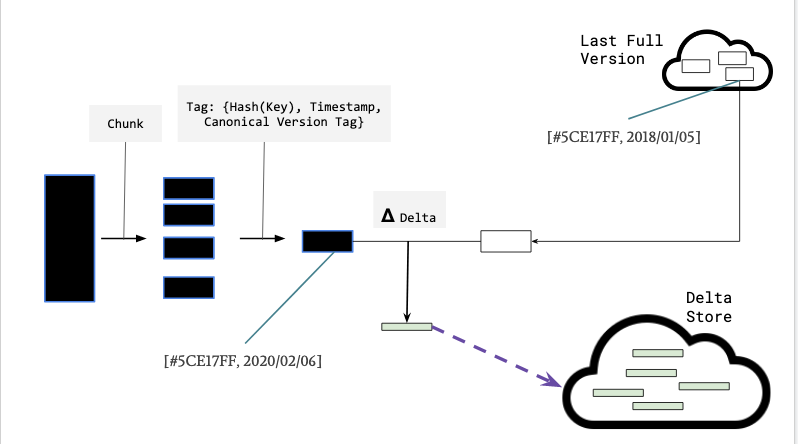

# Oracle: A fast and efficent data versioning pipeline
Oracle is an algorithm and data processing pipeline that provides a fast and efficient data-versioning capability for
large datasets specifically for [Gourdian.net](http://gourdian.net/).

